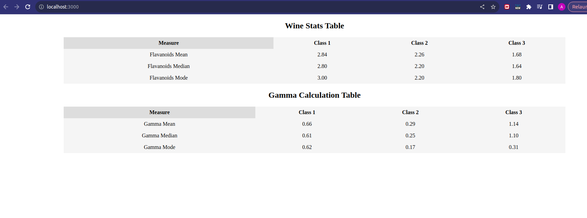

# Manufac SDE 1 Assessment By Atharv Goel

Here is the link to the assignment: [Link](https://drive.google.com/file/d/1Ui7eux0qeOm-YxHNZS7O1wXQ7hSn9WxZ/view)

## Available Scripts

In the project directory, you can run:

### `yarn start`

Runs the app in the development mode.\
Open [http://localhost:3000](http://localhost:3000) to view it in the browser.

The page will reload if you make edits.\
You will also see any lint errors in the console.

You just need to run the `yarn start` and you will be able to run the project.

### If not yet cloned the   project then here's how you can:
1. Take clone of this project: `git clone https/ssh link`
2. On terminal open the root directory of this project
3. Run command `yarn start`
4. Hurray, the react server should now be visible on port 3000.

### Screenshot:
